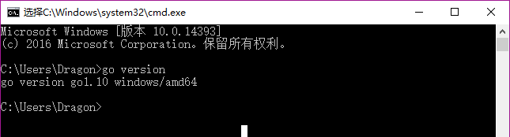
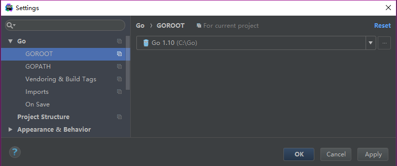
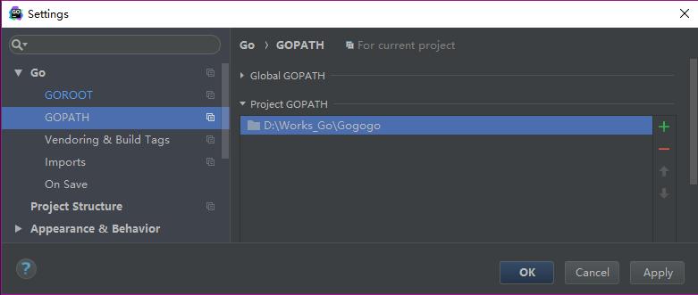
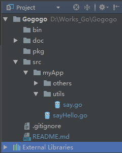
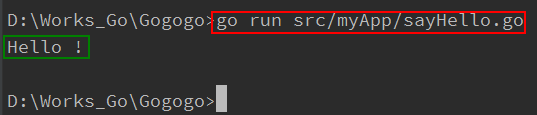
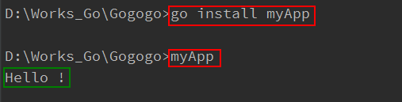
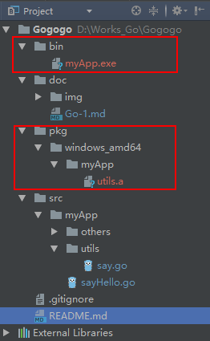

# Go基础

## 1、安装【基于Windows】
  建议下载.msi文件，安装时默认安装在C:\Go\文件夹下（go1.10版本）。
  安装完毕后会自动在系统环境变量的Path中写入C:\Go\bin，并帮我们建立了一个GOROOT的变量，值为C:\Go\。
  
  然后我们打开黑窗口（cmd，命令行）输入：```go version```，出现相应的go的版本则说明安装配置成功。
    
  
## 2、路径
  我开发工具使用的是GoLand，开发前还需要进行下简单配置，打开GoLand在File->Settings->Go中可以看到我们需要进行GOROOT和GOPATH的配置：  
  
#### GOROOT
  就是go的安装路径了，C:\Go，如下图：
    
  
#### GOPATH  
  这个暂时我们设置为我们go工程的目录，比如我们的go工程为D:\Works_Go\Gogogo，那么如下图：
     
  在这个工程目录中我们一般有三个文件夹：
  
  src：该文件夹主要来存放我们的代码源文件，需手动创建。  
  bin：该文件夹一般会存放编译后生成的 .exe 文件，无需手动创建。（如果将该文件写入到系统变量的Path中，
  那么在编译完后对于生成的xxx.exe的文件我们可以直接在黑窗口中敲入xxx去执行，这个bin目录也可以称为 **GOBIN**目录）  
  pkg：该文件夹一般会存放编译后生成的 .a 文件，无需手动创建。  
  
#### GOBIN
  go install命令执行后编译结果存放的路径，见GOPATH中的bin目录。
  
  
## 3、命令
这里以我的工程讲解命令，代码文件很简单，工程结构如下图所示：
  
bin、pkg目录已经说过了，里面没有内容。doc是我写文档的文件夹。src是源代码文件夹（src下的others文件夹我们不去管它，那是我练习时写的代码，跟教程无关）。  

say.go中的源码如下：
```go
package utils

import "fmt"

func SayHello() {
	fmt.Println("Hello !")
}

func SayHi() {
	fmt.Println("Hi !")
}

```  

sayHello.go中源码如下：
```go
package main

import "myApp/utils"

func main() {
	utils.SayHello()
}

```

### go run  
  命令后跟完整文件名，在编辑器底部打开Terminal进入控制台并输入如下命令  
  ```go run src/myApp/sayHello.go```，编译完后便会输出相应的内容。如下图所示：
    
  因为我们在项目的根目录下，所以当编译的sayHello.go文件的时候需要写出他的路径。  
  
### go build
  命令后跟完整文件名，在编辑器底部打开Terminal进入控制台并输入如下命令  
  ```go build src/myApp/sayHello.go```，编译完毕后在项目的根目录下会出现一个sayHello.exe的文件。  
    
  命令后跟目录名，例如在控制台输入  
  ```go build myApp```，编译完毕后在项目的根目录会出现myApp.exe文件。  
  
  
### go install
  命令后跟目录名，例如在控制台输入  
  ```go install myApp```，编译完毕后会在项目的bin文件夹下生成一个main.exe文件。  
  然后我们直接在控制台输入  
  ```myApp```，那么控制台会直接输出我们打印的结果（如果不能成功请检查是否将该bin目录添加到了系统变量Path中），如下图所示：  
  
    
  
  例如在控制台输入  
  ```go install myApp/utils```，编译完毕后会在项目的pkg文件夹中生成utils.a文件（注：bin目录下的myApp.exe文件是上一步运行go build myApp命令产生的），示例如下：  
  
    
  
  **区别在哪里呢？** myApp下包含一个有main包以及main函数的sayHello.go主文件。而utils文件夹下只是库文件。  
  